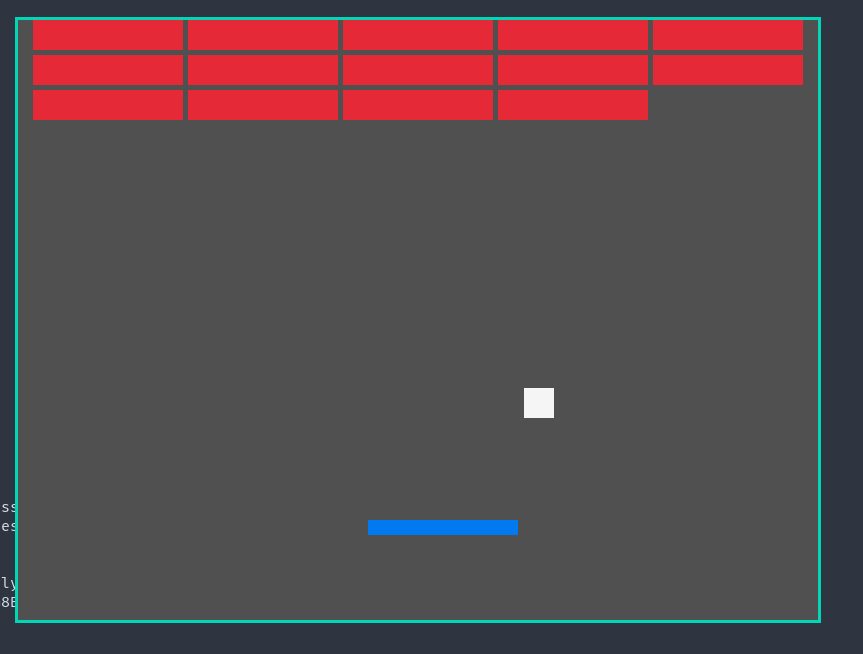

* breakout
A simple recreation of breakout with hare using raylib 5.5.

** How to compile
Put ~libraylib.a~ in ~./vendor/~ and run:
#+begin_src shell
  make
#+end_src
you can then open breakout with:
#+begin_src shell
  ./breakout
#+end_src

** Dependencies
- harec
- hare
- libc
- raylib5.5 for your target
